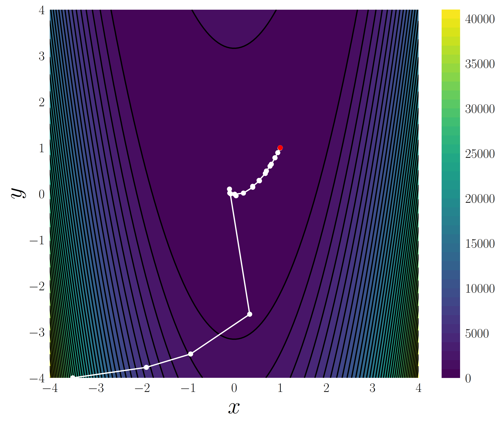

# Introduction

## Example

A simple example used to optimize the classic
[Rosenbrock function](https://en.wikipedia.org/wiki/Rosenbrock_function)
is provided below. The function is given by
$$
f(x, y) = a (y - x^2)^2 + b (x - 1)^2,
$$
which has an optimum at $ [1, 1] $ for $ a > 0 $ and $ b > 0 $. The problem is
set up with default parameters in the following example (see complete code at
[examples/high-level-api.py](https://github.com/alexfikl/pycgdescent/blob/main/examples/high-level-api.py#L19-L65)).
```python
--8<--
examples/high-level-api.py:rosenbrock
--8<--
```

The output of `r.pretty()` shows that we have found the exact solution::

                fun : 6.019745113421725e-23
                jac : 3.0587488097952063e-10
            message : 'Convergence tolerance satisfied'
               nfev : 63
                nit : 28
               njev : 35
        nsubspaceit : 0
         nsubspaces : 0
             status : 0
            success : True
                  x : array([1., 1.])

The path of the optimization can be seen in the following figure.

<div style="text-align: center;">
  
</div>

# API Reference

::: pycgdescent

# Changelog

--8<--
CHANGELOG.md
--8<--
